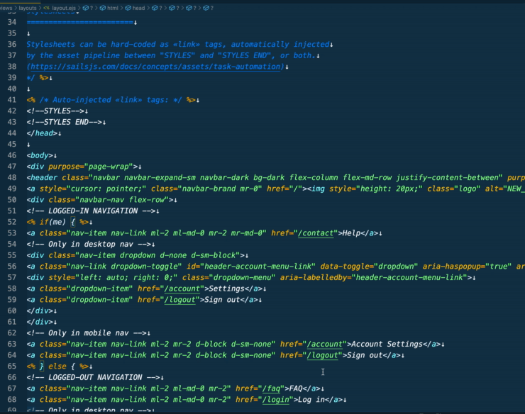

# EJS Beautify

## Features

A formatter extension for EJS files for VS Code. 'js-beautify' is used as the format engine.



### 1.0.3

Current release.

## settings

Please add the following to 'settings.json'.

```
 "emmet.includeLanguages": {
    "ejs": "html",
  },
 "[html]": {
    "editor.defaultFormatter": "j69.ejs-beautify"
  },
```